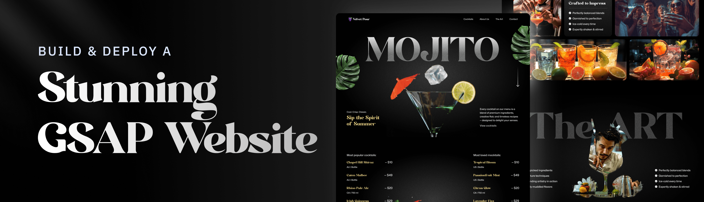
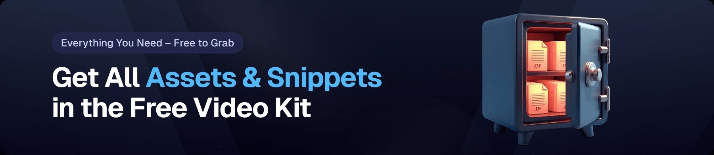

<div align="center">
  <br />
    <a href="https://www.youtube.com/watch?v=AW1yfBKRMKc" target="_blank">
      
    </a>
  <br />

   <div>
    
    
    
    
  </div>

  <h3 align="center">Stunning GSAP Cocktail Website</h3>

   <div align="center">
     Build this project step by step with our detailed tutorial on <a href="https://www.youtube.com/@javascriptmastery/videos" target="_blank"><b>JavaScript Mastery</b></a> YouTube. Join the JSM community and master modern web animations!
    </div>
</div>

## 📋 <a name="table">Table of Contents</a>

1. 🤖 [Introduction](#introduction)
2. ⚙️ [Tech Stack](#tech-stack)
3. 🔋 [Features](#features)
4. 🤸 [Quick Start](#quick-start)
5. 📁 [Project Structure](#project-structure)
6. 🎯 [Key Components](#key-components)
7. 🔗 [Assets](#links)
8. 🐛 [Troubleshooting](#troubleshooting)
9. 🤝 [Contributing](#contributing)
10. 📄 [License](#license)
11. 🚀 [More](#more)

## 🚨 Tutorial

This repository contains the code corresponding to an in-depth tutorial available on our YouTube channel, <a href="https://www.youtube.com/@javascriptmastery/videos" target="_blank"><b>JavaScript Mastery</b></a>.

If you prefer visual learning, this is the perfect resource for you. Follow our tutorial to learn how to build projects like these step-by-step in a beginner-friendly manner!

<a href="https://www.youtube.com/watch?v=AW1yfBKRMKc" target="_blank"></a>

## <a name="introduction">🤖 Introduction</a>

Build and deploy a stunning GSAP-powered cocktail website using React and Tailwind CSS—a modern, scroll-driven experience packed with advanced animations. Bring your design to life with dynamic SplitText animations, smooth parallax scrolling, and interactive visual effects.

This project showcases professional-grade animation techniques that can be applied to any modern web application. Whether you're building a product showcase, portfolio, or creative agency website, the patterns and practices learned here will elevate your animation skills.

**What You'll Learn:**
- Advanced GSAP animation techniques
- ScrollTrigger implementation for scroll-driven animations
- React component architecture for animations
- Responsive design with Tailwind CSS
- Video synchronization with scroll events
- Custom carousel development
- Performance optimization for animations

If you're getting started and need assistance or face any bugs, join our active Discord community with over **50k+** members. It's a place where people help each other out.

<a href="https://discord.com/invite/n6EdbFJ" target="_blank"></a>

## <a name="tech-stack">⚙️ Tech Stack</a>

- **[GSAP](https://gsap.com/)** (GreenSock Animation Platform) - A powerful JavaScript animation library that handles all the complex animations in this project. Features include:
  - **SplitText**: Advanced text animation plugin for character, word, and line-based effects
  - **ScrollTrigger**: Scroll-based animation and parallax control
  - **Timeline**: Sequenced animations for complex multi-step effects
  - **Easing**: Professional easing functions for natural motion

- **[React](https://react.dev/)** - A declarative JavaScript library for building interactive UIs. Provides:
  - Component-based architecture for modular development
  - Hooks for state management and side effects
  - Virtual DOM for efficient rendering
  - Smooth integration with GSAP animations

- **[Tailwind CSS](https://tailwindcss.com/)** - A utility-first CSS framework that allows developers to design custom user interfaces by:
  - Applying low-level utility classes directly in HTML
  - Streamlining responsive design implementation
  - Ensuring consistent styling across components
  - Reducing custom CSS while maintaining flexibility

- **[Vite](https://vitejs.dev/)** - A lightning-fast build tool and development server that powers this project's workflow:
  - Instant hot module replacement (HMR)
  - Fast startup and development experience
  - Optimized production builds
  - ES modules support for modern JavaScript

## <a name="features">🔋 Features</a>

👉 **SplitText Animations**: Create impactful text reveals using GSAP's SplitText for dynamic intros and section highlights.

👉 **ScrollTrigger Effects**: Power scroll-based animations and timeline control with GSAP's ScrollTrigger for engaging scroll experiences.

👉 **Parallax Scrolling**: Add immersive depth with smooth parallax effects that respond to user scroll position.

👉 **Pinned Sections**: Lock sections in view while animating content for engaging scroll experiences.

👉 **Scroll-Synced Video Playback**: Sync video progress with scroll position for cinematic storytelling.

👉 **Image Masking Effects**: Use scroll-triggered pins and masks for visually striking image transitions.

👉 **Custom Carousel**: Build a fully customized carousel with multiple navigation options and animated slides.

👉 **Seamless Timeline Animations**: Craft smooth animation timelines that span across multiple sections.

👉 **Responsive Design**: Ensure fluid UI and adaptive GSAP animations across all screen sizes.

👉 **Performance Optimized**: Efficient animation rendering with minimal repaints and reflows.

👉 **Mobile-Friendly**: Optimized touch interactions and animations for mobile devices.

👉 **Dark Mode Support**: Beautiful animations that work seamlessly in light and dark themes.

## <a name="quick-start">🤸 Quick Start</a>

Follow these steps to set up the project locally on your machine.

### **Prerequisites**

Make sure you have the following installed on your machine:

- [Git](https://git-scm.com/) (v2.0 or higher)
- [Node.js](https://nodejs.org/en) (v16.0 or higher)
- [npm](https://www.npmjs.com/) (v7.0 or higher) or [yarn](https://yarnpkg.com/)

### **Cloning the Repository**

```bash
git clone https://github.com/chiagsapara405-source/gsap_cocktail.git
cd gsap_cocktail
```

### **Installation**

Install the project dependencies using npm:

```bash
npm install
```

Or if you prefer yarn:

```bash
yarn install
```

### **Running the Project**

Start the development server:

```bash
npm run dev
```

Or with yarn:

```bash
yarn dev
```

Open [http://localhost:5173](http://localhost:5173) in your browser to view the project.

### **Building for Production**

Create an optimized production build:

```bash
npm run build
```

Preview the production build locally:

```bash
npm run preview
```

## <a name="project-structure">📁 Project Structure</a>

```
gsap_cocktail/
├── public/
│   ├── readme/
│   │   ├── hero.png
│   │   ├── videokit.png
│   │   └── jsmpro.png
│   └── assets/
│       ├── images/
│       ├── videos/
│       └── icons/
├── src/
│   ├── components/
│   │   ├── Header.jsx
│   │   ├── Hero.jsx
│   │   ├── Features.jsx
│   │   ├── ScrollTriggerSection.jsx
│   │   ├── Carousel.jsx
│   │   ├── Footer.jsx
│   │   └── ...
│   ├── animations/
│   │   ├── gsapAnimations.js
│   │   ├── scrollTrigger.js
│   │   └── timelines.js
│   ├── styles/
│   │   ├── globals.css
│   │   ├── tailwind.css
│   │   └── animations.css
│   ├── hooks/
│   │   ├── useGSAP.js
│   │   └── useScrollTrigger.js
│   ├── utils/
│   │   ├── helpers.js
│   │   └── constants.js
│   ├── App.jsx
│   └── main.jsx
├── .gitignore
├── index.html
├── package.json
├── tailwind.config.js
├── vite.config.js
└── README.md
```

## <a name="key-components">🎯 Key Components</a>

### **Header Component**
The navigation bar featuring:
- Sticky positioning with animation
- Responsive mobile menu
- Smooth scroll navigation links

### **Hero Section**
Eye-catching landing section with:
- Full-screen video background
- SplitText title animation
- Animated CTA buttons
- Parallax background effects

### **Features Section**
Showcase of key features with:
- Staggered card animations
- Hover effects on feature items
- Icon animations with GSAP
- Description reveals on scroll

### **ScrollTrigger Section**
Advanced scroll-based animations:
- Pin animations for section locking
- Progress bar animations
- Timeline-based multi-step animations

### **Custom Carousel**
Interactive carousel with:
- Smooth slide transitions
- Navigation controls
- Auto-play functionality
- Responsive design

### **Video Section**
Demonstrates:
- Scroll-synced video playback
- Video progress control
- Frame-based animations
- Responsive video containers

## <a name="links">🔗 Assets</a>

Assets and snippets used in the project can be found in the **[Video Kit](https://jsm.dev/cocktail-kit)**.

<a href="https://jsm.dev/cocktail-kit" target="_blank">
  
</a>

### **Additional Resources**

- [GSAP Documentation](https://gsap.com/docs/)
- [React Documentation](https://react.dev/)
- [Tailwind CSS Docs](https://tailwindcss.com/docs)
- [Vite Guide](https://vitejs.dev/guide/)
- [ScrollTrigger Examples](https://gsap.com/docs/v3/Plugins/ScrollTrigger/)

## <a name="troubleshooting">🐛 Troubleshooting</a>

### **Common Issues**

**1. Animations not triggering on scroll**
- Clear browser cache and rebuild the project
- Check browser console for JavaScript errors
- Ensure ScrollTrigger plugin is properly imported and registered
- Verify viewport height and scroll container settings

**2. Videos not syncing with scroll**
- Check video file path and ensure it's accessible
- Verify video codec compatibility (MP4 recommended)
- Check browser console for CORS errors
- Ensure video duration is set correctly in JavaScript

**3. Performance issues on mobile devices**
- Reduce the number of simultaneous animations
- Use `will-change` CSS property sparingly
- Enable GPU acceleration with `transform: translate3d()`
- Test on actual devices, not just browser emulation

**4. Build errors with Vite**
- Delete `node_modules` and `package-lock.json`, then run `npm install`
- Clear `.vite` cache folder
- Ensure Node.js version is v16 or higher
- Check for conflicting global packages

**5. Styles not applying correctly**
- Verify Tailwind CSS configuration includes all template paths
- Restart development server after modifying `tailwind.config.js`
- Check CSS specificity conflicts in `globals.css`
- Ensure Tailwind directives are properly imported

### **Debug Mode**

Enable debug logging for animations:

```javascript
// In your animation files
gsap.defaults({ clearProps: true });
console.log("Animation starting...");
```

## <a name="contributing">🤝 Contributing</a>

We welcome contributions to improve this project! Here's how you can help:

1. **Fork the repository** on GitHub
2. **Create a feature branch** (`git checkout -b feature/amazing-feature`)
3. **Commit your changes** (`git commit -m 'Add some amazing feature'`)
4. **Push to the branch** (`git push origin feature/amazing-feature`)
5. **Open a Pull Request** with a clear description of your changes

### **Development Guidelines**

- Follow the existing code style and structure
- Write meaningful commit messages
- Test your changes in multiple browsers
- Ensure responsive design works on mobile
- Update documentation if needed
- Comment complex animation logic

## <a name="license">📄 License</a>

This project is open-sourced under the **MIT License**. See the LICENSE file for more details.

You are free to:
- ✅ Use this project for personal and commercial purposes
- ✅ Modify and distribute the code
- ✅ Use it as a base for your own projects

You must:
- ⚠️ Include the license and copyright notice in any distribution

## <a name="more">🚀 More</a>

### **Advance your skills with JavaScript Mastery Courses**

Enjoyed creating this project? Dive deeper into our comprehensive courses for a richer learning adventure. They're packed with detailed explanations, cool features, and exercises to boost your skills.

<a href="https://jsm.dev/cocktail-nextjs" target="_blank">
  
</a>

### **Explore More Projects**

Visit our [YouTube Channel](https://www.youtube.com/@javascriptmastery/videos) for more amazing tutorials and projects.

### **Stay Connected**

- 📧 **Newsletter**: Subscribe to our newsletter for weekly tips and tutorials
- 🐦 **Twitter**: Follow us on [Twitter](https://twitter.com/jsmasterys) for updates
- 💬 **Discord**: Join our [Discord community](https://discord.com/invite/n6EdbFJ) for support and networking
- 🎥 **YouTube**: Subscribe to [JavaScript Mastery](https://www.youtube.com/@javascriptmastery) for more content

---

<div align="center">
  <p>Made with ❤️ by <a href="https://www.youtube.com/@javascriptmastery">JavaScript Mastery</a></p>
  <p>Happy Coding! 🚀</p>
</div>
